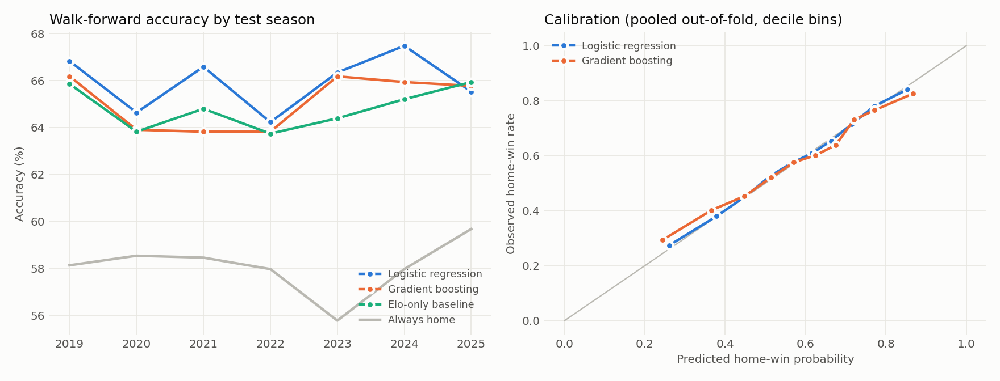

# Win-probability model: walk-forward evaluation

12,300 games; 7 expanding-window folds (train on all earlier seasons, test on the next); 8,610 out-of-fold predictions.

## Summary (mean ± std across folds)

| Model | Accuracy | Log loss | Brier | ECE (pooled) |
|---|---|---|---|---|
| Logistic regression | 65.9% ± 1.2 | 0.616 ± 0.009 | 0.214 ± 0.004 | 0.012 |
| Gradient boosting | 65.1% ± 1.2 | 0.626 ± 0.011 | 0.218 ± 0.005 | 0.020 |
| Elo only (baseline) | 64.8% ± 0.9 | – | – | – |
| Better record (baseline) | 63.0% ± 1.6 | – | – | – |
| Always home team (baseline) | 58.1% ± 1.2 | – | – | – |

Logistic regression lift over the always-home baseline: 13.6% (relative).

## Per fold

| Test season | Train seasons | Train games | LR acc | GB acc | Elo acc | Home acc |
|---|---|---|---|---|---|---|
| 2019 | 2017-2018 | 2,460 | 66.8% | 66.2% | 65.9% | 58.1% |
| 2020 | 2017-2019 | 3,690 | 64.6% | 63.9% | 63.8% | 58.5% |
| 2021 | 2017-2020 | 4,920 | 66.6% | 63.8% | 64.8% | 58.5% |
| 2022 | 2017-2021 | 6,150 | 64.2% | 63.8% | 63.7% | 58.0% |
| 2023 | 2017-2022 | 7,380 | 66.3% | 66.2% | 64.4% | 55.8% |
| 2024 | 2017-2023 | 8,610 | 67.5% | 65.9% | 65.2% | 58.0% |
| 2025 | 2017-2024 | 9,840 | 65.5% | 65.8% | 65.9% | 59.7% |

## Parity with the Java model (same split and regularization)

| | scikit-learn | Java backend |
|---|---|---|
| Test accuracy | 66.4% | 66.5% |
| Test log loss | 0.6094 | 0.6094 |
| Test Brier | 0.2113 | 0.2113 |

Largest coefficient difference: 0.0002.

